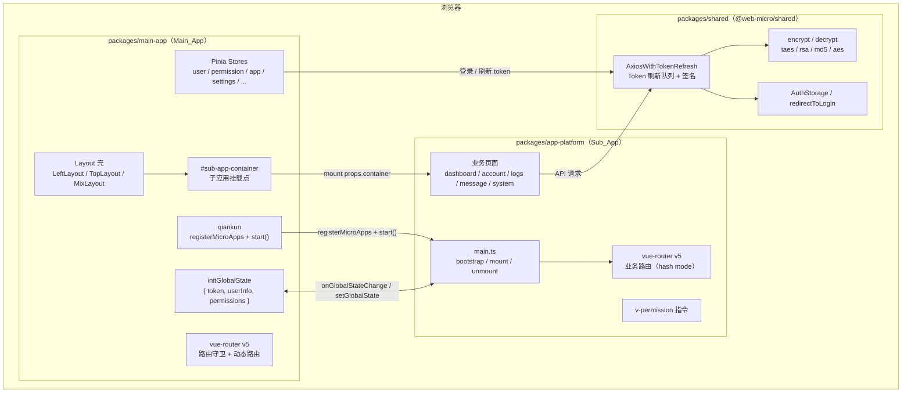
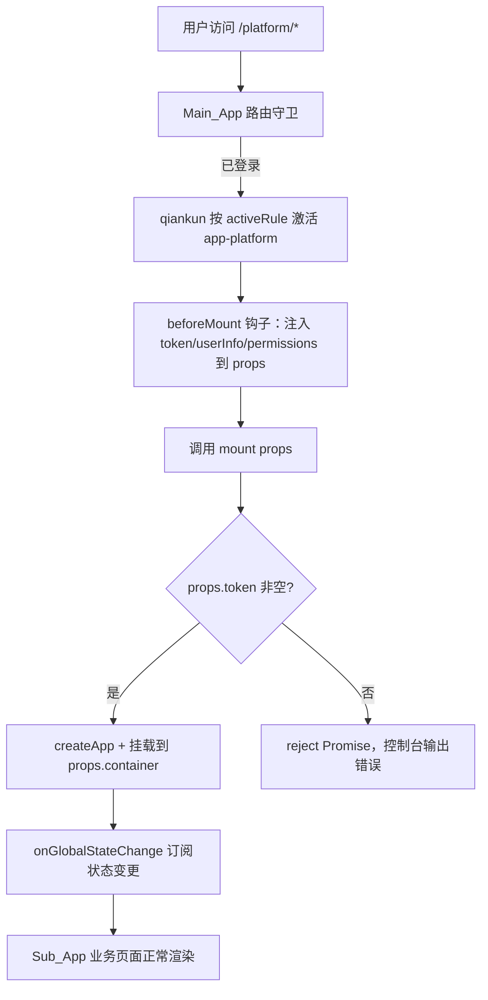
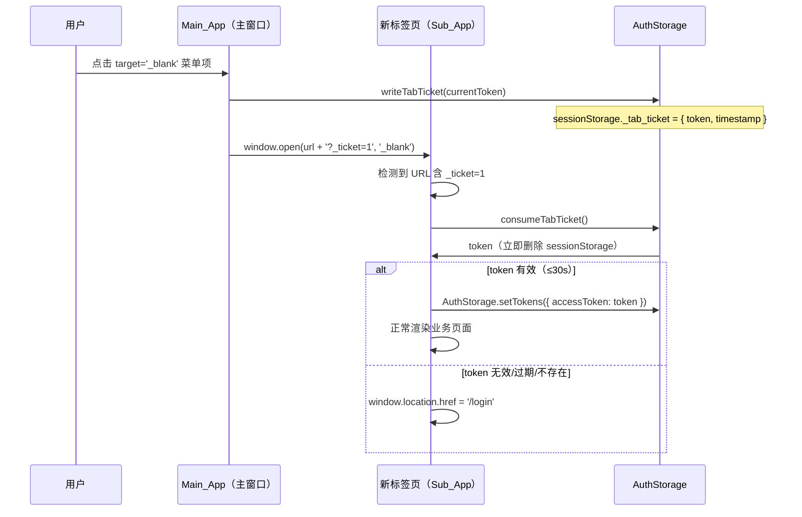

# Design Document：web-micro-qiankun 微前端迁移

## 1. 总览（架构决策表）

| 决策点 | 方案 | 理由 |
|---|---|---|
| 微前端框架 | qiankun v2 | 成熟稳定，支持 Vue 3；`registerMicroApps` + `initGlobalState` API 完备 |
| 包管理 | pnpm monorepo | 工作区协议 (`workspace:*`) 支持本地包引用，与原项目工具链一致 |
| 构建工具（主/子应用） | Vite 8（`@vitejs/plugin-vue`） | 延续 `web-monolith` 技术栈，Rolldown + Oxc 构建更快 |
| 构建工具（Shared） | Rollup（rollup-plugin-typescript2） | 需要 CJS + ESM 双格式产物，Rollup tree-shaking 效果最佳 |
| 子应用输出格式 | UMD | qiankun 通过 `window['app-platform']` 读取生命周期，必须 UMD |
| 样式隔离 | `experimentalStyleIsolation: true` | Shadow DOM 对 Element Plus 兼容性差，选用 CSS Scoping 方案 |
| 状态共享 | `initGlobalState` | 轻量、官方支持，避免跨应用直接引用 Pinia store |
| Layout 归属 | Main_App | Sub_App 只渲染内容区，布局由主应用壳决定，关注点分离 |
| visitor 路由归属 | 主应用保留自身 visitor + 子应用各自维护 `/visitor/**` 路由 | 约定免登录入口，主应用守卫识别路径中含 `/visitor/` 片段直接放行 |
| SSE 连接归属 | Main_App 全局单例（`useSse`） | 避免子应用各自建立连接，服务端只维护一个 push 通道 |
| Dev_Mode 独立运行 | 子应用入口双模判断 `window.__POWERED_BY_QIANKUN__` | 开发效率，无需启动主应用即可调试业务页面 |
| externals（Sub_App） | vue、vue-router、pinia、element-plus 由主应用提供 | 避免重复加载；生产环境由主应用 CDN/bundle 统一管理 |


## 2. 整体架构图



**数据流说明：**

1. 用户访问 Main_App → 路由守卫检查登录状态 → 登录成功后写入 `GlobalState.token`
2. qiankun 按 `activeRule` 激活 Sub_App → 调用 `mount(props)` → Sub_App 创建 Vue 实例
3. Sub_App 从 `props` 读取 token，写入本地响应式状态 → HTTP 拦截器附加 `Authorization` 头
4. 权限变更时 Main_App 调用 `setGlobalState({ permissions })` → Sub_App 回调更新 `v-permission`


## 3. monorepo 目录结构

下表注明每个文件的来源（`迁移自 web-monolith` / `新增`）。

```
web-micro/
├── package.json                          # 新增：根 package，含 build:all 脚本
├── pnpm-workspace.yaml                   # 新增：声明 packages: ['packages/*']
├── .npmrc                                # 迁移自 web-monolith/.npmrc
├── eslint.config.ts                      # 迁移自 web-monolith/eslint.config.ts
├── .prettierrc.yaml                      # 迁移自 web-monolith/.prettierrc.yaml
├── .stylelintrc.cjs                      # 迁移自 web-monolith/.stylelintrc.cjs
├── mock/                                 # 迁移自 web-monolith/mock/（根级共享 mock）
│
├── packages/
│   ├── shared/                           # @web-micro/shared
│   │   ├── package.json                  # 新增：name="@web-micro/shared"，rollup 构建
│   │   ├── tsconfig.json                 # 迁移自 web-monolith/tsconfig.json（裁剪）
│   │   ├── rollup.config.ts              # 新增：CJS + ESM 双格式输出
│   │   └── src/
│   │       ├── index.ts                  # 新增：统一导出入口
│   │       ├── utils/
│   │       │   ├── crypto.ts             # 迁移自 web-monolith/src/utils/crypto.ts（完整复制）
│   │       │   ├── http.ts               # 迁移自 web-monolith/src/utils/http.ts（useUserStoreHook 改为构造函数注入）
│   │       │   ├── auth.ts               # 迁移自 web-monolith/src/utils/auth.ts（redirectToLogin 改为参数注入 router）
│   │       │   ├── common.ts             # 迁移自 web-monolith/src/utils/common.ts（仅 guid/getRangeDate/assert/passwordComplex）
│   │       │   └── file.ts               # 迁移自 web-monolith/src/utils/file.ts（http.ts 依赖）
│   │       ├── enums/
│   │       │   └── result.enum.ts        # 迁移自 web-monolith/src/enums/system/result.enum.ts
│   │       └── constants/
│   │           └── index.ts              # 迁移自 web-monolith/src/constants/（STORAGE_KEYS 等）
│   │
│   ├── main-app/                         # @web-micro/main-app（主应用基座）
│   │   ├── package.json                  # 新增：name="@web-micro/main-app"，含 qiankun ^2.x
│   │   ├── vite.config.ts                # 迁移自 web-monolith/vite.config.ts（去除 UMD，增加 qiankun 注册逻辑）
│   │   ├── tsconfig.json                 # 迁移自 web-monolith/tsconfig.json
│   │   ├── index.html                    # 迁移自 web-monolith/index.html
│   │   ├── uno.config.ts                 # 迁移自 web-monolith/uno.config.ts
│   │   ├── nginx.conf.template           # 新增：生产部署 nginx 配置模板
│   │   ├── public/                       # 迁移自 web-monolith/public/
│   │   └── src/
│   │       ├── main.ts                   # 迁移自 web-monolith/src/main.ts（增加 qiankun 初始化调用）
│   │       ├── App.vue                   # 迁移自 web-monolith/src/App.vue
│   │       ├── settings.ts               # 迁移自 web-monolith/src/settings.ts
│   │       ├── micro/
│   │       │   ├── register.ts           # 新增：registerMicroApps + start() 配置
│   │       │   └── global-state.ts       # 新增：initGlobalState 封装与 beforeMount 注入逻辑
│   │       ├── layouts/                  # 迁移自 web-monolith/src/layouts/（完整复制，不重写）
│   │       │   ├── LeftLayout.vue
│   │       │   ├── TopLayout.vue
│   │       │   ├── MixLayout.vue
│   │       │   ├── BaseLayout.vue
│   │       │   ├── frame.vue
│   │       │   ├── redirect.vue
│   │       │   ├── index.vue
│   │       │   ├── useLayout.ts
│   │       │   └── components/
│   │       ├── router/
│   │       │   ├── index.ts              # 迁移自 web-monolith/src/router/index.ts（静态路由）
│   │       │   ├── permission.ts         # 迁移自 web-monolith/src/router/permission.ts（保留 /visitor/ 白名单）
│   │       │   └── modules/              # 迁移自 web-monolith/src/router/modules/（静态路由模块）
│   │       ├── stores/
│   │       │   ├── index.ts              # 迁移自 web-monolith/src/stores/index.ts
│   │       │   └── modules/              # 迁移自 web-monolith/src/stores/modules/（全部 8 个 store）
│   │       │       ├── app.store.ts
│   │       │       ├── dict.store.ts
│   │       │       ├── permission.store.ts
│   │       │       ├── return-code.store.ts
│   │       │       ├── settings.store.ts
│   │       │       ├── tags-view.store.ts
│   │       │       ├── tenant.store.ts
│   │       │       └── user.store.ts
│   │       ├── views/
│   │       │   ├── login/                # 迁移自 web-monolith/src/views/login/（完整复制）
│   │       │   ├── welcome/              # 迁移自 web-monolith/src/views/welcome/
│   │       │   ├── profile/              # 迁移自 web-monolith/src/views/profile/
│   │       │   ├── visitor/              # 迁移自 web-monolith/src/views/visitor/
│   │       │   └── error/                # 迁移自 web-monolith/src/views/error/（403/404）
│   │       ├── components/               # 迁移自 web-monolith/src/components/（仅 Layout 依赖的全局组件）
│   │       ├── directives/               # 迁移自 web-monolith/src/directives/（主应用指令）
│   │       ├── plugins/                  # 迁移自 web-monolith/src/plugins/
│   │       ├── styles/                   # 迁移自 web-monolith/src/styles/
│   │       ├── lang/                     # 迁移自 web-monolith/src/lang/
│   │       ├── types/                    # 迁移自 web-monolith/src/types/
│   │       ├── constants/                # 迁移自 web-monolith/src/constants/
│   │       ├── enums/                    # 迁移自 web-monolith/src/enums/
│   │       └── api/
│   │           └── auth.ts               # 迁移自 web-monolith/src/api/auth.ts（登录/刷新 token 接口）
│   │
│   └── app-platform/                     # @web-micro/app-platform（业务子应用）
│       ├── package.json                  # 新增：name="@web-micro/app-platform"，含 qiankun ^2.x
│       ├── vite.config.ts                # 新增：lib 模式 UMD，CORS headers，externals
│       ├── tsconfig.json                 # 迁移自 web-monolith/tsconfig.json（裁剪）
│       ├── index.html                    # 新增：Dev_Mode 独立运行入口 HTML
│       └── src/
│           ├── main.ts                   # 新增：qiankun 生命周期导出 + Dev_Mode 双模入口
│           ├── App.vue                   # 新增：子应用根组件（仅 <router-view>）
│           ├── router/
│           │   ├── index.ts              # 新增：路由工厂（createRouter，根据模式选 base）
│           │   └── routes.ts             # 迁移自 web-monolith/src/router/modules/（业务路由模块）
│           ├── stores/
│           │   └── index.ts              # 新增：子应用独立 Pinia 实例（仅业务相关 store）
│           ├── views/
│           │   ├── dashboard/            # 迁移自 web-monolith/src/views/dashboard/
│           │   ├── account/              # 迁移自 web-monolith/src/views/account/
│           │   ├── logs/                 # 迁移自 web-monolith/src/views/logs/
│           │   ├── message/              # 迁移自 web-monolith/src/views/message/
│           │   └── system/               # 迁移自 web-monolith/src/views/system/
│           ├── api/                      # 迁移自 web-monolith/src/api/（业务接口，import http 改为 @web-micro/shared）
│           ├── components/               # 迁移自 web-monolith/src/components/（业务组件，排除 Layout 相关）
│           ├── directives/
│           │   └── permission.ts         # 新增：v-permission 指令，基于 Global_State.permissions
│           ├── composables/              # 迁移自 web-monolith/src/composables/（业务 composables）
│           └── styles/                   # 迁移自 web-monolith/src/styles/（子应用样式）
```


## 4. 数据模型

### 4.1 Global_State 结构

```typescript
// packages/main-app/src/micro/global-state.ts

interface GlobalState {
  /** 访问令牌，登录成功后由 Main_App 写入；Sub_App 只读 */
  token: string;
  /** 当前登录用户信息，对应 web-monolith UserInfo 类型 */
  userInfo: {
    userId?: string;
    username?: string;
    nickname?: string;
    avatar?: string;
    currentRoleId?: string;
    currentRoleName?: string;
    tenantId?: string;
    [key: string]: any;
  };
  /** 权限码数组，来自 permissionStore.generateRoutes 返回的 moduleType=005002 节点的 moduleCode */
  permissions: string[];
}

// 初始值
const initialState: GlobalState = {
  token: '',
  userInfo: {},
  permissions: [],
  fullscreen: null,
  notifications: { unreadCount: 0 },
};
```

### 4.2 qiankun Props 结构（Sub_App mount 接收）

```typescript
// packages/app-platform/src/main.ts

interface QiankunProps {
  /** 子应用挂载的容器元素（由 qiankun 注入） */
  container: HTMLElement;
  /** 当前 Global_State 快照（挂载时的初始值） */
  token: string;
  userInfo: Record<string, any>;
  permissions: string[];
  /** 订阅 Global_State 变更 */
  onGlobalStateChange: (
    callback: (state: GlobalState, prev: GlobalState) => void,
    fireImmediately?: boolean
  ) => void;
  /** 向 Main_App 推送部分状态更新 */
  setGlobalState: (state: Partial<GlobalState>) => void;
}
```

### 4.3 AuthStorage 存储结构

| Key（localStorage / sessionStorage） | 说明 | 来源 |
|---|---|---|
| `access_token` | JWT 访问令牌 | 迁移自 `web-monolith/src/utils/auth.ts` |
| `refresh_token` | 刷新令牌 | 同上 |
| `appkey` | 应用标识（签名用） | 同上 |
| `secret` | 应用密钥（签名用） | 同上 |
| `device_id` | 设备指纹 ID | 同上 |
| `LANGUAGE` | 用户语言偏好 | 同上 |

remember-me 为 `true` 时使用 `localStorage`，否则使用 `sessionStorage`，存储位置由 `AuthStorage` 内部管理，外部无需感知。


## 5. 主应用设计（Main_App）

### 5.1 qiankun 注册配置

```typescript
// packages/main-app/src/micro/register.ts
import { registerMicroApps, start } from 'qiankun'

export function setupMicroApps() {
  registerMicroApps(
    [
      {
        name: 'app-platform',
        // Dev: http://localhost:7101  Prod: 由 VITE_SUB_APP_ENTRY 环境变量控制
        entry: import.meta.env.VITE_SUB_APP_ENTRY ?? 'http://localhost:7101',
        container: '#sub-app-container',
        activeRule: '/platform',  // 所有 /platform/* 路由激活子应用
        props: {},  // 初始 props 为空，beforeMount 钩子注入最新状态
      },
    ],
    {
      beforeMount: [
        async (app) => {
          // 在挂载子应用前，将最新 Pinia store 状态注入 props
          const { getGlobalActions } = await import('./global-state')
          const actions = getGlobalActions()
          const { token, userInfo, permissions } = actions.getState()
          // qiankun 通过 props 将状态传递给子应用 mount(props)
          Object.assign(app.props, { token, userInfo, permissions })
        },
      ],
    }
  )

  start({
    sandbox: {
      experimentalStyleIsolation: true,  // CSS Scoping 样式隔离
    },
  })
}
```

**主应用 `main.ts` 初始化顺序：**

```typescript
// packages/main-app/src/main.ts
const app = createApp(App)

setupDirective(app)
setupRouter(app)      // 1. 路由（含 permission.ts 守卫）
setupStore(app)       // 2. Pinia stores
setupI18n(app)        // 3. 国际化

// 全局组件、第三方插件（同 web-monolith/src/main.ts）
// ...

setupPermissionGuard()  // 4. 路由守卫
setupMicroApps()        // 5. qiankun 注册（必须在 store 初始化之后）
initGlobalState()       // 6. Global_State 初始化

app.mount('#app')
```

### 5.2 Global_State 管理

```typescript
// packages/main-app/src/micro/global-state.ts
import { initGlobalState, type MicroAppStateActions } from 'qiankun'

let actions: MicroAppStateActions

export function initAppGlobalState() {
  actions = initGlobalState({
    token: '',
    userInfo: {},
    permissions: [],
  })

  // 监听变更（主应用自身也可监听，用于调试）
  actions.onGlobalStateChange((state, prev) => {
    console.log('[Main_App] GlobalState changed:', prev, '->', state)
  })
}

export function getGlobalActions() {
  return {
    getState: () => {
      // qiankun 未直接提供 getState，通过闭包缓存当前值
      return currentState
    },
    setState: (patch: Partial<GlobalState>) => {
      currentState = { ...currentState, ...patch }
      actions.setGlobalState(patch)
    },
  }
}

let currentState: GlobalState = { token: '', userInfo: {}, permissions: [] }
```

### 5.3 登录成功后的状态写入流程

```
用户登录成功
  └─ userStore.login(credentials)
       └─ 保存 token 到 AuthStorage
       └─ getGlobalActions().setState({ token, userInfo })
       └─ permissionStore.generateRoutes(currentRoleId)
            └─ 收集 moduleType === '005002' 的 moduleCode 列表
            └─ getGlobalActions().setState({ permissions })
            └─ 动态路由通过 router.addRoute() 注册到 Main_App
```

### 5.4 退出登录流程

```
用户点击退出
  └─ userStore.logout()
       └─ 调用后端登出接口
       └─ AuthStorage.clearTokens()
       └─ 各 Pinia store 调用 $reset()（app/dict/permission/settings/tags-view/tenant/user）
       └─ getGlobalActions().setState({ token: '', userInfo: {}, permissions: [] })
       └─ router.push('/login')
```

### 5.5 路由守卫白名单（扩展 visitor 片段判断）

```typescript
// packages/main-app/src/router/permission.ts（关键片段）
const whiteList = ['/login', '/403', '/404']

router.beforeEach(async (to, from) => {
  // 白名单 + 任意路径中含 /visitor/ 片段直接放行（覆盖子应用前缀，如 /platform/visitor/**）
  if (whiteList.includes(to.path) || to.path.includes('/visitor/')) {
    return true
  }
  // ... 其余逻辑与 web-monolith 完全一致
})
```

`#sub-app-container` 在 Layout 的内容区插槽中渲染，确保子应用始终在 Layout 壳内展示。

### 5.6 菜单节点数据结构与点击行为

#### MenuNode 字段（新增 fullscreen / target）

```typescript
interface MenuNode {
  id: string
  moduleCode: string
  moduleType: '005001' | '005002'   // 005001=菜单项，005002=按钮权限
  menuName: string
  visible: boolean                   // false 时不渲染菜单项，但仍注册路由
  sortIdx: number                    // 同级升序排序
  popup: boolean                     // true=弹窗打开
  url: string                        // 跳转目标
  path: string                       // 路由路径
  params: { key: string; val: string; enabled: boolean }[] | null
  children: MenuNode[]
  // 扩展字段（后端可选，前端兜底默认值）
  target?: '_self' | '_blank'        // 默认 '_self'
  fullscreen?: boolean               // 默认 false；为 true 时点击触发全屏模式
}
```

#### 菜单渲染规则

| 规则 | 说明 |
|---|---|
| 仅渲染 `moduleType === '005001'` 节点 | `005002`（按钮权限）不产生菜单项 |
| `visible === false` 不渲染但仍注册路由 | 传递性：父节点 `visible=false` 时子节点也不渲染 |
| 同级按 `sortIdx` 升序排序 | 递归应用于所有层级 |
| `target`/`fullscreen` 缺失时兜底默认值 | `parseMenuTree()` 负责补全 |

#### 菜单点击逻辑（四种场景，优先级从高到低）

```typescript
// packages/main-app/src/layouts/components/LayoutSidebar.vue 或 useLayout.ts

function buildQueryString(params: MenuNode['params']): string {
  if (!params?.length) return ''
  const parts = params
    .filter(p => p.enabled)
    .map(p => `${encodeURIComponent(p.key)}=${encodeURIComponent(p.val)}`)
  return parts.length ? '?' + parts.join('&') : ''
}

function handleMenuClick(node: MenuNode) {
  const qs = buildQueryString(node.params)
  const fullUrl = node.url + qs

  // 场景1：popup=true → 弹窗打开，不执行路由跳转
  if (node.popup) {
    window.open(fullUrl, '_blank', 'width=1200,height=800')
    return
  }

  // 场景2：target='_blank' → Tab_Ticket + 新标签页
  if (node.target === '_blank') {
    writeTabTicket(AuthStorage.getAccessToken())
    const ticketUrl = fullUrl + (qs ? '&' : '?') + '_ticket=1'
    window.open(ticketUrl, '_blank')
    return
  }

  // 场景3：fullscreen=true → 全屏模式 + 路由跳转
  if (node.fullscreen) {
    appStore.setFullscreen(true)
  }

  // 场景4：普通路由跳转（或场景3的路由部分）
  router.push(node.path + qs).catch(() => {})
}
```

**路由变更后的全屏状态自动重置：**

```typescript
// packages/main-app/src/router/permission.ts 或 main.ts
router.afterEach((to) => {
  // 目标路由对应菜单节点 fullscreen=false 时，自动重置全屏状态
  const matchedMenu = permissionStore.findMenuByPath(to.path)
  if (matchedMenu && !matchedMenu.fullscreen) {
    appStore.setFullscreen(false)
  }
})
```


## 6. 子应用设计（Sub_App / app-platform）

### 6.1 qiankun 生命周期导出（Vue 3 方式）

```typescript
// packages/app-platform/src/main.ts
import { createApp, type App } from 'vue'
import AppComponent from './App.vue'
import { createAppRouter } from './router'
import { createPinia } from 'pinia'
import ElementPlus from 'element-plus'
import { setupPermissionDirective } from './directives/permission'

let app: App | null = null
let unsubscribeGlobalState: (() => void) | null = null

/**
 * 一次性全局初始化（不创建 Vue 实例）
 */
export async function bootstrap(): Promise<void> {
  console.log('[app-platform] bootstrap')
  // Element Plus 图标等全局注册可在此处进行
}

/**
 * 挂载子应用
 */
export async function mount(props: QiankunProps): Promise<void> {
  // Prod_Mode：token 为空时拒绝挂载
  if (window.__POWERED_BY_QIANKUN__ && !props.token) {
    const msg = '[app-platform] 缺少 token，拒绝挂载'
    console.error(msg)
    return Promise.reject(new Error(msg))
  }

  const pinia = createPinia()
  const router = createAppRouter(props)

  app = createApp(AppComponent)
  app.use(router)
  app.use(pinia)
  app.use(ElementPlus)
  setupPermissionDirective(app, props)

  // 订阅 Global_State 变更
  props.onGlobalStateChange((state) => {
    // 更新子应用内部响应式状态（token、permissions 等）
    syncGlobalState(state)
  }, true /* fireImmediately: 挂载时立即触发一次，同步初始值 */)

  // 挂载到主应用提供的容器
  app.mount(props.container.querySelector('#sub-app-container')!)
}

/**
 * 卸载子应用
 */
export async function unmount(): Promise<void> {
  // 注销 Global_State 监听
  if (unsubscribeGlobalState) {
    unsubscribeGlobalState()
    unsubscribeGlobalState = null
  }
  app?.unmount()
  app = null
}
```

### 6.2 Dev_Mode / Prod_Mode 双模入口

```typescript
// packages/app-platform/src/main.ts（入口底部）

// 仅在非 qiankun 环境（Dev_Mode 独立运行）时直接挂载
if (!window.__POWERED_BY_QIANKUN__) {
  const pinia = createPinia()
  const router = createAppRouter({} as QiankunProps)
  const devApp = createApp(AppComponent)
  devApp.use(router)
  devApp.use(pinia)
  devApp.use(ElementPlus)
  // Dev_Mode 下权限数组来自本地 AuthStorage 或固定 mock 值
  setupPermissionDirective(devApp, { permissions: [] } as any)
  devApp.mount('#app')
}
```

### 6.3 路由工厂

```typescript
// packages/app-platform/src/router/index.ts
import { createRouter, createWebHashHistory } from 'vue-router'
import { businessRoutes } from './routes'

export function createAppRouter(props: Partial<QiankunProps>) {
  // Sub_App 使用 hash 模式，避免与主应用 history 路由冲突
  // base 在 qiankun 环境下由 activeRule 决定，独立运行时为 '/'
  return createRouter({
    history: createWebHashHistory(
      window.__POWERED_BY_QIANKUN__ ? '/platform' : '/'
    ),
    routes: [
      ...businessRoutes,
      // Dev_Mode 404 兜底
      {
        path: '/:pathMatch(.*)*',
        component: () => import('./views/error/404.vue'),
      },
    ],
  })
}
```

### 6.4 `v-permission` 自定义指令

```typescript
// packages/app-platform/src/directives/permission.ts
import type { App, DirectiveBinding } from 'vue'
import type { QiankunProps } from '../main'

// 响应式权限数组，由 onGlobalStateChange 回调更新
let currentPermissions: string[] = []

export function updatePermissions(perms: string[]) {
  currentPermissions = perms
}

function hasPermission(code: string | null | undefined): boolean {
  if (!code) return false
  return currentPermissions.includes(code)
}

export function setupPermissionDirective(app: App, initialProps: Partial<QiankunProps>) {
  currentPermissions = initialProps.permissions ?? []

  app.directive('permission', {
    mounted(el: HTMLElement, binding: DirectiveBinding<string>) {
      if (!hasPermission(binding.value)) {
        el.parentNode?.removeChild(el)
      }
    },
    updated(el: HTMLElement, binding: DirectiveBinding<string>) {
      // permissions 变更后重新评估（通过父组件重渲染触发）
      if (!hasPermission(binding.value) && el.parentNode) {
        el.parentNode.removeChild(el)
      }
    },
  })
}
```

> **注意：** `v-permission` 移除 DOM 元素（`removeChild`），而非 `display:none`，确保无权限的操作按钮在 DOM 层完全不存在，防止通过 CSS 绕过权限控制。


## 7. Shared 模块设计

### 7.1 HTTP 封装改造要点

原 `web-monolith/src/utils/http.ts` 中 `AxiosWithTokenRefresh` 直接调用 `useUserStoreHook()`（依赖 Pinia 实例），无法直接在 Shared 包中使用。改造方案：**通过构造函数参数注入 UserStore 的依赖接口**。

```typescript
// packages/shared/src/utils/http.ts（改造片段）

export interface UserStoreAdapter {
  /** 执行 token 刷新，返回新的 token 信息 */
  refreshToken(): Promise<{ accessToken: string; expireTime?: number }>
}

class AxiosWithTokenRefresh {
  private userStore: UserStoreAdapter

  constructor(config: AxiosRequestConfig = {}, userStore: UserStoreAdapter) {
    this.userStore = userStore
    // ... 其余初始化与原实现一致
  }

  async refreshAccessToken() {
    // 将原来的 useUserStoreHook().refreshToken() 替换为：
    this.userStore.refreshToken().then(...)
  }
}

// 工厂函数（各应用调用时传入自己的 store 适配器）
export function createHttpInstance(
  config: AxiosRequestConfig,
  userStore: UserStoreAdapter
): AxiosWithTokenRefresh {
  return new AxiosWithTokenRefresh(config, userStore)
}
```

**Main_App 使用示例：**

```typescript
// packages/main-app/src/api/http.ts
import { createHttpInstance } from '@web-micro/shared'
import { useUserStore } from '@/stores'

export const http = createHttpInstance({}, {
  refreshToken: () => useUserStore().refreshToken(),
})
```

**Sub_App 使用示例：**

```typescript
// packages/app-platform/src/api/http.ts
import { createHttpInstance } from '@web-micro/shared'

// Sub_App 无 user store，token 刷新委托给 Main_App 通过 Global_State 下发
// 若 token 过期，由 http 拦截器调用 props.setGlobalState 触发主应用刷新
export const http = createHttpInstance({}, {
  refreshToken: () => Promise.reject(new Error('Sub_App 不直接刷新 token')),
})
```

### 7.2 `generateSignature` 函数

`generateSignature` 从 `AuthStorage` 读取 token、appkey、secret、deviceId 生成请求签名，不依赖 Pinia store，可直接迁移，无需改造。

### 7.3 crypto.ts 复制说明

`packages/shared/src/utils/crypto.ts` 为 **完整复制** `web-monolith/src/utils/crypto.ts`，保留：

| 导出 | 功能 |
|---|---|
| `encrypt.md5(str)` | MD5 32 位小写十六进制 |
| `encrypt.sha256(str)` | SHA256 64 位 |
| `encrypt.aes(str, key)` | AES CBC/PKCS7 加密 |
| `encrypt.taes(str)` | 时间因子 AES 加密（5 秒粒度） |
| `encrypt.rsa(str, publicKey)` | RSA 公钥加密（Base64→Hex） |
| `encrypt.password(pwd, rsaKey?)` | 密码加密：MD5 + RSA（降级 taes） |
| `decrypt.aes(hex, key)` | AES 解密 |
| `decrypt.taes(hex)` | 时间因子 AES 解密（±1 窗口重试） |
| `decrypt.rsa(hex, publicKey)` | RSA 解密 |

**不允许删改任何加解密逻辑**，避免服务端解密失败。

### 7.4 auth.ts 改造要点

```typescript
// packages/shared/src/utils/auth.ts（改造片段）
// 原实现直接 import router from '@/router'，改为参数注入

export function redirectToLogin(
  message?: string,
  useRedirectParam?: boolean,
  to?: RouteLocationNormalized,
  router?: Router  // 新增参数
): RouteLocationRaw {
  // 构造登录跳转目标，逻辑与原实现一致
  const loginRoute = { path: '/login', query: to ? { redirect: to.fullPath } : {} }
  if (router) {
    router.push(loginRoute)
  }
  return loginRoute
}
```

### 7.5 Shared 构建配置（Rollup）

```typescript
// packages/shared/rollup.config.ts
import { defineConfig } from 'rollup'
import typescript from 'rollup-plugin-typescript2'

export default defineConfig([
  // ESM 格式
  {
    input: 'src/index.ts',
    output: { file: 'dist/index.esm.js', format: 'esm', sourcemap: true },
    plugins: [typescript()],
    external: ['axios', 'crypto-js', 'jsencrypt'],
  },
  // CJS 格式
  {
    input: 'src/index.ts',
    output: { file: 'dist/index.cjs.js', format: 'cjs', sourcemap: true },
    plugins: [typescript()],
    external: ['axios', 'crypto-js', 'jsencrypt'],
  },
])
```

`package.json` 字段：
```json
{
  "name": "@web-micro/shared",
  "main": "dist/index.cjs.js",
  "module": "dist/index.esm.js",
  "types": "dist/index.d.ts",
  "exports": {
    ".": {
      "import": "./dist/index.esm.js",
      "require": "./dist/index.cjs.js"
    }
  }
}
```


## 8. 构建配置设计

### 8.1 Main_App（packages/main-app/vite.config.ts）

以 `web-monolith/vite.config.ts` 为基础，主要变更点：

```typescript
// packages/main-app/vite.config.ts（关键差异，其余与 web-monolith 保持一致）
export default defineConfig(({ mode }) => ({
  base: '/',
  server: {
    port: 7100,
    headers: {},  // 主应用不需要额外 CORS 头
    // proxy 配置与 web-monolith 保持一致
  },
  build: {
    outDir: 'dist',
    // 使用 web-monolith 相同的 rolldownOptions 分包策略
    // 不配置 lib 模式（主应用为 SPA 标准输出，非 UMD）
  },
  // AutoImport / Components / UnoCSS 插件配置与 web-monolith 完全一致
}))
```

> Sub_App 的 externals 将 vue、pinia、element-plus 等排除在构建产物之外，由主应用提供，**主应用 Vite 配置中不得出现 UMD lib 配置**。

### 8.2 Sub_App（packages/app-platform/vite.config.ts）

```typescript
// packages/app-platform/vite.config.ts
import { defineConfig, loadEnv } from 'vite'
import vue from '@vitejs/plugin-vue'
import { resolve } from 'path'

export default defineConfig(({ mode }) => {
  const env = loadEnv(mode, process.cwd())

  return {
    base: env.VITE_APP_PUBLIC_PATH || '/',
    plugins: [vue()],
    resolve: {
      alias: { '@': resolve(__dirname, 'src') },
    },
    server: {
      port: 7101,
      // 允许主应用跨域加载子应用资源（qiankun 核心要求）
      headers: {
        'Access-Control-Allow-Origin': '*',
      },
      // 开启 mock 模式时禁用 proxy，反之启用
      ...(env.VITE_APP_USE_MOCK === 'true'
        ? {}
        : {
            proxy: {
              [env.VITE_APP_BASE_API]: {
                target: env.VITE_APP_API_URL,
                changeOrigin: true,
                rewrite: (p: string) =>
                  p.replace(new RegExp(`^${env.VITE_APP_BASE_API}`), ''),
              },
            },
          }),
    },
    build: {
      outDir: 'dist',
      // lib 模式：qiankun 要求 UMD 输出，name 必须与 registerMicroApps 的 name 一致
      lib: {
        entry: resolve(__dirname, 'src/main.ts'),
        name: 'app-platform',
        formats: ['umd'],
        fileName: () => 'app-platform.umd.js',
      },
      rollupOptions: {
        // 排除主应用已提供的依赖，避免重复打包
        external: ['vue', 'vue-router', 'pinia', 'element-plus'],
        output: {
          // 声明全局变量映射（UMD 格式需要）
          globals: {
            vue: 'Vue',
            'vue-router': 'VueRouter',
            pinia: 'Pinia',
            'element-plus': 'ElementPlus',
          },
        },
      },
    },
  }
})
```

**关键说明：**
- `lib.name: 'app-platform'` 对应 qiankun 通过 `window['app-platform']` 读取生命周期函数
- `Access-Control-Allow-Origin: *` 是 qiankun 加载子应用 JS/CSS 的必要条件
- `external` 中排除的依赖由主应用在全局作用域暴露，子应用 UMD 通过 `globals` 映射读取

### 8.3 Shared 包（packages/shared）

使用 Rollup（见 §7.5），输出 ESM + CJS 双格式，不使用 Vite lib 模式。

### 8.4 根目录 package.json 构建脚本

```json
{
  "scripts": {
    "build:shared": "pnpm --filter @web-micro/shared run build",
    "build:sub": "pnpm --filter @web-micro/app-platform run build",
    "build:main": "pnpm --filter @web-micro/main-app run build",
    "build:all": "pnpm run build:shared && pnpm run build:sub && pnpm run build:main",
    "dev:main": "pnpm --filter @web-micro/main-app run dev",
    "dev:sub": "pnpm --filter @web-micro/app-platform run dev"
  }
}
```

构建顺序：`shared` → `app-platform` → `main-app`，任一步骤失败立即终止（`&&` 语义）。


## 9. Dev_Mode vs Prod_Mode 运行时对比

| 维度 | Dev_Mode | Prod_Mode |
|---|---|---|
| `window.__POWERED_BY_QIANKUN__` | `false`（未定义） | `true`（qiankun 注入） |
| Sub_App 启动方式 | `index.html` 直接加载 `src/main.ts`，调用 `createApp` 并 `mount('#app')` | 由 qiankun `mount(props)` 生命周期调用 `createApp` 并挂载至 `props.container` |
| 主应用是否需要运行 | 不需要，Sub_App 可独立启动（`pnpm run dev:sub`） | 必须，Sub_App 作为 qiankun 子应用由主应用加载 |
| Token 来源 | `AuthStorage.getAccessToken()`（本地 storage） | `props.token`（由 qiankun `beforeMount` 从主应用 Pinia store 注入） |
| 路由 | 本地静态路由表（hash mode，base `/`） | 同上，但 base 为 `/platform`，由主应用 `activeRule` 控制激活 |
| 权限数据来源 | Dev_Mode 可使用 mock 固定权限码，或通过独立登录获取 | `props.permissions`（由 Global_State 传入，随主应用权限变更同步更新） |
| 登录逻辑 | Sub_App 提供独立登录页（复用 login 组件，或简化入口） | 登录由主应用处理，Sub_App 不展示登录页，token 为空时直接 reject mount |
| HTTP 请求 | 通过 Vite proxy 代理到后端（或 mock 模式） | 生产环境直连 `VITE_APP_API_URL`，或经 nginx 反向代理 |
| 样式隔离 | 无隔离（独立运行，无冲突） | qiankun `experimentalStyleIsolation: true`，CSS Scoping 自动隔离 |
| Global_State 监听 | 不注册（`props` 为空） | `props.onGlobalStateChange(callback, true)` 订阅 token/permissions 变更 |
| 热更新（HMR） | Vite HMR 完整支持 | 主应用加载 Sub_App 时 HMR 仍工作（需子应用 devServer 运行中） |
| 构建产物 | 不需要，开发时直接运行 devServer | UMD 格式 `app-platform.umd.js`，nginx 静态托管 |
| 404 处理 | Sub_App 内置 `/:pathMatch(.*)` 兜底路由，显示 404 页 + "返回首页"链接 | 由主应用路由守卫兜底，重定向至 `/error/404` |
| mock 服务 | `VITE_APP_USE_MOCK=true` 启用 `vite-plugin-mock-dev-server` | 不启用，所有请求真实转发 |

### 9.1 Sub_App 独立启动流程图（Dev_Mode）

```mermaid
flowchart TD
  A[pnpm run dev:sub] --> B{window.__POWERED_BY_QIANKUN__?}
  B -- false --> C[直接 createApp + mount '#app']
  C --> D{AuthStorage.getAccessToken() 非空?}
  D -- 是 --> E[进入业务首页]
  D -- 否 --> F[展示独立登录页]
  F --> G[用户登录成功]
  G --> H[AuthStorage.setTokens]
  H --> E
```

### 9.2 Sub_App qiankun 加载流程图（Prod_Mode）




## 10. 错误处理

| 场景 | 处理方式 |
|---|---|
| Sub_App devServer 不可达 | qiankun 加载失败，主应用 `loadMicroApp` 捕获异常，控制台输出警告，不阻塞主应用渲染 |
| `mount(props)` 收到空 token（Prod_Mode） | `reject Promise`，打印 `[app-platform] 缺少 token，拒绝挂载`，qiankun 将错误向上抛出 |
| token 过期（HTTP 401） | `AxiosWithTokenRefresh` 进入刷新队列；Sub_App 调用 `props.setGlobalState` 通知主应用刷新，刷新完成后主应用更新 Global_State |
| token 被踢出（`TOKEN_KICK_OUT`） | `redirectToLogin()` 触发跳转登录页，清除 AuthStorage |
| `decrypt.taes` 时间窗口不匹配 | 自动重试 key-1 和 key+1，三次失败后抛出 `Error('taes 解密失败：时间因子不匹配')` |
| `v-permission` 绑定空值 | 指令判断 `!code` 直接移除 DOM，不抛出异常 |
| `build:all` 任一包构建失败 | `&&` 语义立即终止，以非零退出码退出 |


## 11. 正确性属性（Correctness Properties）

*属性是在系统所有有效执行中都应保持为真的特征或行为——本质上是对系统应做什么的形式化陈述。属性充当人类可读规范与机器可验证正确性保证之间的桥梁。*

### Property 1：taes 加解密 round-trip

*对任意* 非空字符串明文 `plaintext`，先调用 `encrypt.taes(plaintext)` 再立即调用 `decrypt.taes(ciphertext)` 所得结果，应与原始明文完全相同。

**Validates: Requirements 2.9**

### Property 2：mount token 守卫

*对任意* `props` 对象，当 `window.__POWERED_BY_QIANKUN__ === true` 且 `props.token` 为空字符串时，`mount(props)` 应 reject 并输出包含"缺少 token"字样的错误；当 `props.token` 为任意非空字符串时，`mount(props)` 不应因 token 缺失而 reject。

**Validates: Requirements 4.8**

### Property 3：v-permission 指令正确性

*对任意* 权限码字符串 `code` 和任意权限码数组 `permissions`：
- 若 `permissions.includes(code)` 为 `true`，则绑定了 `v-permission="code"` 的 DOM 元素应存在于文档中；
- 若 `permissions.includes(code)` 为 `false`（含 `code` 为空字符串、`null`、`undefined` 的情况），则该元素应已从 DOM 中移除，且不抛出任何异常。

**Validates: Requirements 5.5, 5.7**

---

## 12. 测试策略

### 12.1 单元测试

使用 **Vitest**（与 `web-monolith` 保持一致），覆盖：

- `@web-micro/shared`：`encrypt.*` / `decrypt.*` 所有导出函数的具体示例测试
- `AxiosWithTokenRefresh`：请求队列机制、签名生成函数的 mock 测试
- `AuthStorage`：localStorage / sessionStorage 切换逻辑
- Sub_App `createAppRouter`：Dev_Mode vs Prod_Mode base 参数

### 12.2 属性测试

使用 **fast-check**（已在 `web-monolith/package.json` 中声明），每个属性测试配置最少 **100 次迭代**：

```typescript
// packages/shared/src/__tests__/crypto.property.test.ts
import { describe, it } from 'vitest'
import * as fc from 'fast-check'
import { encrypt, decrypt } from '../utils/crypto'

// Feature: web-micro-qiankun, Property 1: taes round-trip
describe('Property 1: taes 加解密 round-trip', () => {
  it('对任意非空字符串，encrypt.taes 后 decrypt.taes 应还原原文', () => {
    fc.assert(
      fc.property(fc.string({ minLength: 1 }), (plaintext) => {
        const ciphertext = encrypt.taes(plaintext)
        const recovered = decrypt.taes(ciphertext)
        return recovered === plaintext
      }),
      { numRuns: 100 }
    )
  })
})
```

```typescript
// packages/app-platform/src/__tests__/permission.property.test.ts
import { describe, it } from 'vitest'
import * as fc from 'fast-check'

// Feature: web-micro-qiankun, Property 3: v-permission correctness
describe('Property 3: v-permission 指令正确性', () => {
  it('对任意权限码和权限数组，指令应正确保留或移除 DOM', () => {
    fc.assert(
      fc.property(
        fc.string(),
        fc.array(fc.string()),
        (code, permissions) => {
          const hasPermission = Boolean(code) && permissions.includes(code)
          const result = simulatePermissionDirective(code, permissions)
          return result.elementInDom === hasPermission
        }
      ),
      { numRuns: 100 }
    )
  })
})
```

### 12.3 集成测试

- qiankun `registerMicroApps` + `start()` 调用验证（mock qiankun API）
- Global_State `initGlobalState` 初始值验证
- `onGlobalStateChange` 回调在 token 变更时触发验证
- HTTP 请求拦截器 token 注入验证（mock axios adapter）

### 12.4 Smoke 测试

- `pnpm-workspace.yaml` 内容验证
- 各子包 `package.json` 依赖版本符合要求
- Sub_App `main.ts` 导出 `bootstrap` / `mount` / `unmount` 三个函数
- `pnpm run build:all` 退出码为 0，各 `dist/` 目录非空


---

## 13. SSE 消息通知设计

### 13.1 迁移策略

`web-monolith/src/composables/sse/` 整体复制至 `packages/main-app/src/composables/sse/`，包含以下文件，只调整 import 路径：

| 文件 | 职责 |
|---|---|
| `useSse.ts` | 全局单例 SSE 连接管理（Fetch Streams API，指数退避重连） |
| `useNoticeSync.ts` | 消息通知事件分发（HEARTBEAT / kickOut / notify / message / todo） |
| `useDictSync.ts` | 数据字典同步推送 |
| `useOnlineCount.ts` | 在线人数实时推送 |
| `useEventSource.ts` | 多种 SSE 实现方案（fetchEventSource / 标准 EventSource / 自定义） |
| `index.ts` | 统一导出 |

### 13.2 主窗口判断规则

只有满足以下全部条件的窗口才允许建立 SSE 连接：

```typescript
// packages/main-app/src/composables/sse/useSse.ts（主窗口判断辅助函数）
function isMainWindow(): boolean {
  // 条件1：非通过 window.open 打开的衍生窗口
  const notOpened = window.opener === null

  // 条件2：非 Tab_Ticket 新标签页（URL 不含 _ticket=1 参数）
  const notTicketPage = !new URLSearchParams(window.location.search).has('_ticket') &&
                        !window.location.href.includes('_ticket=1')

  return notOpened && notTicketPage
}
```

**衍生窗口的典型场景：**
- 用户 Ctrl+点击菜单项 → `window.opener !== null`
- 菜单项配置 `target: '_blank'` 通过 `window.open()` 打开 → `window.opener !== null`
- Tab_Ticket 鉴权的新标签页（URL 含 `_ticket=1`）→ `notTicketPage === false`

### 13.3 SSE 连接生命周期

```typescript
// packages/main-app/src/stores/modules/user.store.ts（关键片段）
async login(loginData) {
  const result = await authApi.login(loginData)
  AuthStorage.setTokens(result.tokens)

  // 主窗口判断后再建立连接
  if (isMainWindow()) {
    useSse().connect()
    useNoticeSync().initialize()
  } else {
    console.warn('[SSE] SSE 连接已跳过，当前窗口非主窗口：', window.location.href)
  }
}

async logout() {
  cleanupSse()          // 主窗口：断开连接；衍生窗口：空操作，不报错
  useNoticeSync().cleanup?.()
  // 其余退出逻辑...
}
```

**重连时的主窗口二次校验（在 `useSse.ts` 的 `scheduleReconnect` 中添加）：**

```typescript
// useSse.ts 的 scheduleReconnect 末尾逻辑示意
const scheduleReconnect = () => {
  // ...原有重试次数检查...

  reconnectTimer = setTimeout(() => {
    // 重连前再次校验：若当前窗口已不再是主窗口，停止重连
    if (!isMainWindow()) {
      log('重连已跳过：当前窗口非主窗口')
      return
    }
    connect()
    // ...指数退避更新...
  }, currentReconnectInterval)
}
```

### 13.4 与微前端的集成方式

SSE 连接由主应用单例管理，子应用不直接接触 SSE：

```
用户在主窗口登录成功
  └─ isMainWindow() === true
       └─ useSse().connect()  ← 建立 SSE 全局连接
       └─ useNoticeSync().initialize()  ← 注册事件监听

用户 Ctrl+点击菜单，新标签页打开
  └─ isMainWindow() === false（window.opener !== null）
       └─ 不调用 useSse().connect()
       └─ console.warn('SSE 连接已跳过...')

SSE 收到 notify 事件（仅主窗口）
  └─ useNoticeSync().onNotify 回调触发
       └─ 更新 Pinia notificationStore（未读数、消息列表）
       └─ 通过 Global_State 推送：getGlobalActions().setState({ notifications: { unreadCount } })
       └─ Sub_App 的 onGlobalStateChange 回调接收更新（仅主窗口内的子应用）

用户退出登录
  └─ userStore.logout()
       └─ cleanupSse()  ← 断开连接、清理全部事件订阅（衍生窗口为空操作）
       └─ getGlobalActions().setState({ token: '', ... })
```

### 13.5 Global_State 扩展字段

在 SSE 消息推送场景下，Global_State 扩展 `notifications` 字段：

```typescript
interface GlobalState {
  token: string
  userInfo: object
  permissions: string[]
  notifications?: {
    unreadCount: number  // 未读消息总数，主应用更新，子应用读取展示徽标
  }
}
```


---

## 14. Visitor 约定免登录入口设计

### 14.1 路由守卫扩展规则

将原 `permission.ts` 的白名单判断从：

```typescript
// 原实现
if (whiteList.includes(to.path) || to.path.startsWith('/visitor/')) {
  return true
}
```

扩展为：

```typescript
// 新实现：识别任意子应用下的 /visitor/ 路径
if (whiteList.includes(to.path) || to.path.includes('/visitor/')) {
  return true
}
```

`includes` 而非 `startsWith` 的原因：子应用路由带有 activeRule 前缀，如 `/platform/visitor/ecg/index`，路径中间含有 `/visitor/`。

### 14.2 子应用 activeRule 配置

qiankun 的 `activeRule` 支持函数形式，用于同时匹配多个前缀：

```typescript
// packages/main-app/src/micro/register.ts
registerMicroApps([
  {
    name: 'app-platform',
    entry: import.meta.env.VITE_SUB_APP_ENTRY ?? 'http://localhost:7101',
    container: '#sub-app-container',
    // 同时覆盖业务路由和 visitor 路由
    activeRule: (location) =>
      location.pathname.startsWith('/platform') ||
      location.pathname.startsWith('/platform/visitor'),
    props: {},
  },
])
```

> 实际上 `/platform/visitor` 已被 `/platform` 前缀覆盖，此处用函数形式展示意图；如果 activeRule 是字符串 `/platform`，则 `/platform/visitor/**` 已自然包含在内。

### 14.3 子应用路由表中的 visitor 路由

```typescript
// packages/app-platform/src/router/routes.ts
export const businessRoutes = [
  // 正常业务路由（需登录）
  { path: '/dashboard', component: () => import('@/views/dashboard/index.vue') },
  // ... 其他业务路由

  // visitor 路由（无需登录）——不经过 token 校验
  {
    path: '/visitor',
    children: [
      {
        path: 'ecg/index',
        component: () => import('@/views/visitor/ecg/index.vue'),
        meta: { noAuth: true }  // 标记为免登录路由
      },
      // 后续新增其他公开页面
    ]
  },
]
```

子应用路由守卫中，对 `meta.noAuth === true` 或路径含 `/visitor/` 的路由直接放行，不校验 `AuthStorage.getAccessToken()`。

### 14.4 主应用 dynamic.vue 保持不变

主应用的 `/visitor/dynamic` 路由继续使用 `import.meta.glob('@/views/visitor/**/*.vue')` 加载主应用自身的公开页面（如 `visitor/ecg/index.vue`），与子应用的 visitor 路由相互独立，互不干扰。

### 14.5 新子应用接入约定（示例：app-ecg）

后续新增子应用时遵守如下约定：

```
activeRule: '/ecg'（或函数形式同时覆盖 /ecg/visitor）

子应用路由：
  /ecg/**         → 业务页面（需登录）
  /ecg/visitor/** → 公开页面（免登录，meta.noAuth: true）

路由守卫白名单：
  to.path.includes('/visitor/') 直接放行
```


---

## 15. 无导航栏/全屏模式设计

### 15.1 Pinia store 扩展（app.store.ts）

`web-monolith/src/stores/modules/app.store.ts` 迁移后，确认包含 `layout.fullscreen` 状态：

```typescript
// packages/main-app/src/stores/modules/app.store.ts（关键片段）
export const useAppStore = defineStore('app', {
  state: () => ({
    layout: {
      fullscreen: false,   // 无导航栏模式标志
      // ... 其他 layout 字段
    },
  }),
  actions: {
    setFullscreen(val: boolean) {
      this.layout.fullscreen = val
    },
  },
})
```

### 15.2 Shell_Layout 组件实现

```vue
<!-- packages/main-app/src/layouts/components/LayoutNavbar.vue 或 LeftLayout.vue -->
<template>
  <div class="shell-layout">
    <!-- v-show 保留 DOM，不触发组件销毁/重建，切换性能优 -->
    <layout-navbar v-show="!appStore.layout.fullscreen" />
    <div class="shell-body">
      <layout-sidebar v-show="!appStore.layout.fullscreen" />
      <main
        class="shell-content"
        :class="{ 'shell-content--full': appStore.layout.fullscreen }"
      >
        <!-- 子应用挂载点 -->
        <div id="sub-app-container" />
      </main>
    </div>
  </div>
</template>
```

> 使用 `v-show` 而非 `v-if`：保留 Header/Sidebar 的 DOM，避免子应用容器重渲染导致 qiankun 重新挂载。

### 15.3 Global_State 联动（子应用请求全屏）

```typescript
// packages/main-app/src/micro/global-state.ts（onGlobalStateChange 监听片段）
actions.onGlobalStateChange((state, prev) => {
  // 子应用通过 setGlobalState({ fullscreen: true/false }) 切换全屏
  if (state.fullscreen !== null && state.fullscreen !== prev.fullscreen) {
    useAppStore().setFullscreen(state.fullscreen as boolean)
    // 将 fullscreen 重置为 null，避免下次 onGlobalStateChange 误触发
    actions.setGlobalState({ fullscreen: null })
  }
}, true)
```

Sub_App 侧触发全屏：

```typescript
// 子应用内某个页面组件
props.setGlobalState({ fullscreen: true })   // 进入全屏
props.setGlobalState({ fullscreen: false })  // 退出全屏
```

### 15.4 路由跳转后自动重置全屏状态

```typescript
// packages/main-app/src/router/permission.ts（afterEach 片段）
router.afterEach((to) => {
  const appStore = useAppStore()
  if (!appStore.layout.fullscreen) return

  // 查找目标路由对应的菜单节点
  const matchedMenu = usePermissionStore().findMenuByPath(to.path)
  // 目标页面不要求全屏 → 自动重置
  if (!matchedMenu?.fullscreen) {
    appStore.setFullscreen(false)
  }
})
```

### 15.5 全屏模式 vs 浏览器原生 Fullscreen API

| | 无导航栏模式（本需求） | 浏览器原生 Fullscreen API |
|---|---|---|
| 实现方式 | CSS + `v-show`，`layout.fullscreen` 状态驱动 | `document.requestFullscreen()` |
| Header/Sidebar | 通过 `v-show` 隐藏，DOM 保留 | 整个页面全屏，操作系统级别 |
| 触发方式 | 菜单点击 / 子应用 `setGlobalState` | 用户手势（浏览器安全限制） |
| 退出方式 | 路由跳转 / `setFullscreen(false)` | Esc 键 / `exitFullscreen()` |
| **本项目使用** | ✅ 仅使用此方式 | ❌ 不使用 |


---

## 16. Tab_Ticket 新标签页鉴权设计

### 16.1 工具函数（packages/main-app/src/utils/ticket.ts）

```typescript
// 新增文件，不存在于 web-monolith，需从头实现
const TICKET_KEY = '_tab_ticket'
const TICKET_TTL = 30_000  // 30 秒有效期

interface TabTicket {
  token: string
  timestamp: number
}

/**
 * 写入 Tab_Ticket（主窗口在 window.open 之前调用）
 */
export function writeTabTicket(token: string): void {
  const ticket: TabTicket = { token, timestamp: Date.now() }
  sessionStorage.setItem(TICKET_KEY, JSON.stringify(ticket))
}

/**
 * 一次性消费 Tab_Ticket（新标签页启动时调用）
 * @returns 有效 token，或 null（不存在/已过期/已消费）
 */
export function consumeTabTicket(): string | null {
  const raw = sessionStorage.getItem(TICKET_KEY)
  // 立即删除，无论是否有效（一次性保证）
  sessionStorage.removeItem(TICKET_KEY)
  if (!raw) return null
  try {
    const ticket: TabTicket = JSON.parse(raw)
    const isExpired = Date.now() - ticket.timestamp > TICKET_TTL
    return isExpired ? null : ticket.token
  } catch {
    return null
  }
}

/**
 * 判断当前窗口是否为主窗口
 * 主窗口条件：非 window.open 打开（opener=null）且 URL 不含 _ticket=1
 */
export function isMainWindow(): boolean {
  return (
    window.opener === null &&
    !new URLSearchParams(window.location.search).has('_ticket')
  )
}
```

### 16.2 Sub_App 新标签页启动流程

```typescript
// packages/app-platform/src/main.ts（Dev_Mode 入口底部片段）

if (!window.__POWERED_BY_QIANKUN__) {
  const urlParams = new URLSearchParams(window.location.search)
  const isTicketPage = urlParams.has('_ticket')

  if (isTicketPage) {
    // ── Tab_Ticket 新标签页启动流程 ──
    const token = consumeTabTicket()  // 一次性消费
    if (token) {
      // 有效 Token → 保存到 AuthStorage，正常挂载
      AuthStorage.setTokens({ accessToken: token })
      mountDevApp()
    } else {
      // 无效/过期 → 跳转主应用登录页
      window.location.href = '/login'
    }
  } else {
    // 普通 Dev_Mode 启动（非 ticket 页面）
    mountDevApp()
  }
}
```

### 16.3 完整流程图



### 16.4 安全说明

- Tab_Ticket 存储在 `sessionStorage`，不跨标签页共享（不同于 `localStorage`）
- 一次性消费：`consumeTabTicket()` 读取后立即 `removeItem`，同一新标签页刷新后无法再次读取
- 30 秒有效期：超时即失效，防止 ticket 泄露后被延迟利用
- 仅在 `window.open` 前由主窗口写入，减少 ticket 存在的时间窗口
